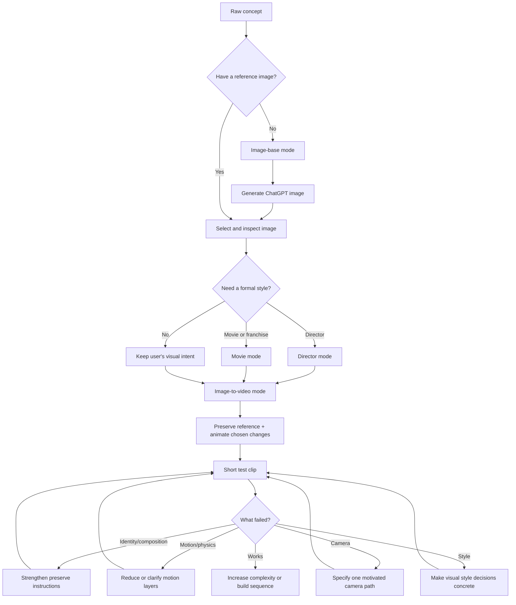

# Cinematic Video Prompt Builder

Turn an idea—or a single reference image—into a clear, cinematic prompt for creating AI images and videos.

You do not need to know camera jargon or prompt engineering. Describe what you want, and the skill helps turn it into specific choices that an image or video tool can understand.

## The simple workflow

```text
Your idea → reference image → animate the image → short test → improve → build the episode
```

The reference image acts as the visual anchor. The skill tells the video tool what to keep and what to change, helping protect the character, clothing, setting, lighting, and overall look.

## What you can use it for

- Create a cinematic starting image.
- Turn that image into a moving shot.
- Choose a director-inspired visual approach.
- Create a movie or franchise homage with original characters and scenes.
- Control camera movement, lenses, lighting, film texture, flash, grain, and color.
- Keep characters, props, locations, wardrobe, and lighting consistent.
- Build connected scenes and full episodes instead of unrelated clips.
- Adapt the same creative idea for different AI generation tools.

## Four modes

**Image-base** — Make the still image that anchors the scene.

**Image-to-video** — Animate the selected image while preserving the important visual details.

**Director** — Apply a director’s recognizable visual grammar—framing, movement, lighting, pacing, and mood—to an original idea.

**Movie** — Create an original homage, close emulation, or continuation-style scene based on a film or franchise’s visual language.

Modes can be combined. For example: create an image with `image-base + director`, then animate it with `image-to-video + movie`.

## Building episodes

For connected storytelling, the skill can maintain a series bible and continuity ledger. It tracks:

- Who each character is and what they are wearing
- Where characters and props are positioned
- Damage, ownership, and condition of props
- Location, time, weather, lighting, and screen direction
- What changed in each shot
- What the next shot must inherit
- How an episode begins, develops, and ends

Start with [WORKFLOW.md](WORKFLOW.md) for the visual chart and [episode-building.md](references/episode-building.md) for the episode process.

## Start using it

Ask for one short test shot first:

```text
$cinematic-video-prompt-builder

Use image-base mode. Create a reference-image prompt for a lone astronaut
standing in a flooded underground station at night.
```

After generating and selecting the image:

```text
$cinematic-video-prompt-builder

Use image-to-video mode. Treat the attached image as the visual source of truth.
Preserve the astronaut, suit, station, lighting, and composition. Animate only
a slow turn toward a distant light and subtle ripples in the water.
Include success criteria.
```

The first test should use one subject, one main action, one camera move, and one environmental movement. This makes it easier to see what needs fixing.

## Workflow at a glance



## Install globally

Copy this folder into your Codex skills directory:

```bash
mkdir -p ~/.codex/skills
cp -R cinematic-video-prompt-builder ~/.codex/skills/
```

Restart Codex or refresh its skills index afterward.

## Repository layout

- `SKILL.md` — entrypoint instructions
- `WORKFLOW.md` — newcomer workflow chart and integration guide
- `references/episode-building.md` — series bibles, episode blueprints, and continuity ledgers
- `agents/openai.yaml` — Codex interface metadata
- `references/` — detailed guidance for styles, continuity, episodes, motion, and platform adaptation
- `examples/` — copy-pasteable example prompts

Platform syntax changes over time. The skill deliberately separates the creative specification from engine-specific translation and marks unsupported or unverified controls.

## Validation

```bash
python3 ~/.codex/skills/.system/skill-creator/scripts/quick_validate.py .
```

## License

MIT. See [LICENSE](LICENSE).
