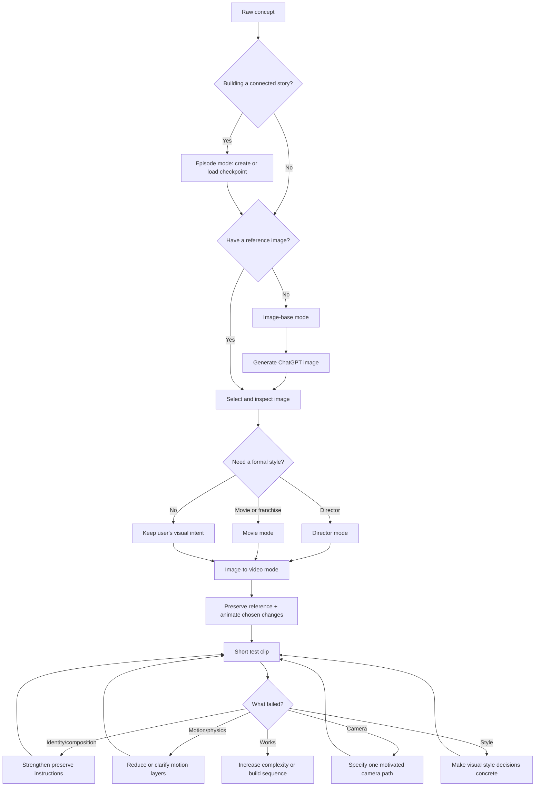

# AI Episode Matrix

Build a continuous AI video story from episode to episode. AI Episode Matrix acts primarily as a script supervisor for AI production: it turns ideas and reference images into clear cinematic prompts while keeping characters, props, locations, visual style, dialogue, timing, and story state consistent.

Continuity is the main goal. Cinematic prompt engineering supports that goal.

## The simple workflow

```text
Your story world → episode checkpoint → reference image → animate the image → continuity update → next scene
```

The reference image acts as the visual anchor. The skill tells the video tool what to keep and what to change, helping protect the character, clothing, setting, lighting, and overall look.

## What you can use it for

- Create a cinematic starting image.
- Turn that image into a moving shot.
- Choose a director-inspired visual approach.
- Create a movie or franchise homage with original characters and scenes.
- Control camera movement, lenses, lighting, film texture, flash, grain, and color.
- Translate director references into concrete camera, lighting, blocking, and physics choices.
- Keep characters, props, locations, wardrobe, and lighting consistent.
- Build connected scenes and full episodes instead of unrelated clips.
- Return to any earlier episode with a continuity checkpoint before creating new material.
- Adapt the same creative idea for different AI generation tools.
- Hand off an approved ChatGPT-generated still to Seedance with explicit preserve/transform instructions.
- Maintain script versions, continuity reports, lore, canon, and production handoffs.

## Six modes inside Episode Matrix

**Image-base** — Make the still image that anchors the scene.

**Image-to-video** — Animate the selected image while preserving the important visual details.

**Director** — Apply a director’s recognizable visual grammar—framing, movement, lighting, pacing, and mood—to an original idea.

**Movie** — Create an original homage, close emulation, or continuation-style scene based on a film or franchise’s visual language.

**Episode** — The primary mode. Start or continue a connected story. It activates the continuity bible immediately and uses script-supervisor checks so each new scene inherits the correct characters, props, locations, wardrobe, lighting, dialogue, timing, and story state.

**Music video** — Build a compact, beat-driven sequence with performance and narrative shots, recurring visual motifs, and either frequent edits or a deliberate one-take choreography plan.

Modes can be combined inside Episode Matrix. For example: use `episode + image-base + director`, then continue with `episode + image-to-video + movie`.

## Building episodes

For connected storytelling, the skill can maintain a series bible and continuity ledger. It tracks:

- Who each character is and what they are wearing
- Where characters and props are positioned
- Damage, ownership, and condition of props
- Location, time, weather, lighting, and screen direction
- What changed in each shot
- What the next shot must inherit
- How an episode begins, develops, and ends

For a returning project, keep these records in the episode folder: `series-bible.yaml`, `episode-XX.yaml`, `continuity-ledger.yaml`, `asset-index.yaml`, and `session-handoff.md`. Episode mode scans for them and reconstructs a checkpoint before continuing. Starter files are available in [`templates/`](templates/).

To check a project folder for missing or malformed records:

```bash
python3 scripts/check_continuity_files.py path/to/episode-project
```

Continuity records are versioned and validated fail-closed. See [versioning-and-migrations.md](references/versioning-and-migrations.md) before changing their shape. Check repository documentation links with `python3 scripts/check_markdown_links.py .`.

The test suite includes offline platform-generation contracts. Live generation tests are not run by default because each engine requires separate credentials, quotas, endpoints, and changing APIs; run a real smoke test in the chosen platform after reviewing the generated prompt and record the result in the episode ledger.

Platform syntax is intentionally treated as versioned reference material. Recheck a platform adapter when its model/interface changes, and record the verified date and source in the adapter. Generated takes require an explicit review note and approval status; prompt-only work is never marked as generated.

Start with [WORKFLOW.md](WORKFLOW.md) for the visual chart and [episode-building.md](references/episode-building.md) for the episode process.

For the common still-to-video path, see the [ChatGPT Image Gen → Seedance example](examples/chatgpt-to-seedance.md) and [Seedance adapter](references/seedance-adapter.md).

## Start using it

Ask for one short test shot first:

```text
$ai-episode-matrix

Use image-base mode. Create a reference-image prompt for a lone astronaut
standing in a flooded underground station at night.
```

After generating and selecting the image:

```text
$ai-episode-matrix

Use image-to-video mode. Treat the attached image as the visual source of truth.
Preserve the astronaut, suit, station, lighting, and composition. Animate only
a slow turn toward a distant light and subtle ripples in the water.
Include success criteria.
```

The first test should use one subject, one main action, one camera move, and one environmental movement. This makes it easier to see what needs fixing.

## Workflow at a glance



## Install globally

Copy this folder into your Codex skills directory:

```bash
mkdir -p ~/.codex/skills
cp -R ai-episode-matrix ~/.codex/skills/
```

Restart Codex or refresh its skills index afterward.

## Repository layout

- `SKILL.md` — entrypoint instructions for AI Episode Matrix
- `WORKFLOW.md` — newcomer workflow chart and integration guide
- `references/episode-building.md` — series bibles, episode blueprints, and continuity ledgers
- `references/script-supervisor-system.md` — production continuity, script tracking, lore, and handoffs
- `references/cinematography-discipline.md` — practical camera, lighting, blocking, physics, and optics vocabulary
- `references/platform-verification.md` — how to verify changing engine behavior
- `references/music-video-mode.md` — compact beat-driven continuity and music-video grammar
- `agents/openai.yaml` — Codex interface metadata
- `references/` — detailed guidance for styles, continuity, episodes, motion, and platform adaptation
- `templates/seedance-image-to-video.txt` and `templates/video-take.yaml` — Seedance prompt and generated-take records
- `templates/seedance-reference-pack.txt` — optional multi-reference role map
- `templates/video-take.yaml` — generated take, review, and approval record
- `templates/music-video-shot.txt` — beat-marked music-video shot prompt
- `examples/` — copy-pasteable example prompts

Platform syntax changes over time. The skill deliberately separates the creative specification from engine-specific translation and marks unsupported or unverified controls.

## Validation

```bash
python3 ~/.codex/skills/.system/skill-creator/scripts/quick_validate.py .
python3 scripts/check_markdown_links.py .
python3 -m unittest discover -s tests
```

## License

MIT. See [LICENSE](LICENSE).
