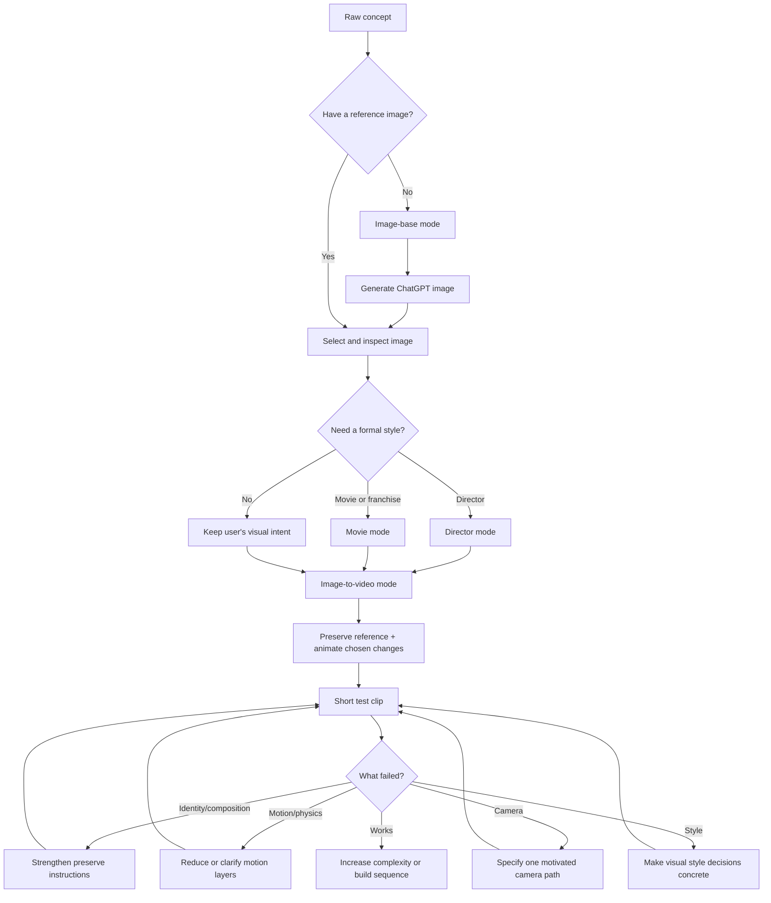

# Cinematic Video Prompt Builder

A Codex skill for turning raw concepts and reference images into controllable, cinematic AI image and video prompts.

## What it does

The skill is designed around the common workflow:

```text
concept → image-base prompt → selected image → image-to-video prompt → short test → targeted refinement
```

It supports four composable modes:

- **Image-base** — create the still image that anchors continuity.
- **Image-to-video** — animate that image while preserving identity, composition, wardrobe, lighting, and production design.
- **Director** — translate a director’s formal grammar into observable choices.
- **Movie** — create an homage, close emulation, or continuation using a film’s visual grammar.

It also includes platform-adapter guidance, aesthetic knobs, multi-shot continuity, episode building, motion grammar, and an evaluation rubric.

Start with [WORKFLOW.md](WORKFLOW.md) for the visual decision chart, first-test recipe, and integration guidance.

## Workflow at a glance



## Install globally

Copy this folder into your Codex skills directory:

```bash
mkdir -p ~/.codex/skills
cp -R cinematic-video-prompt-builder ~/.codex/skills/
```

Restart Codex or refresh its skills index afterward.

## Example requests

```text
Create an image-base prompt for a lone astronaut standing in a flooded subway station.
Use 65/70mm large-format presentation, restrained Portra-like color, and director mode inspired by Carpenter’s spatial suspense.
```

```text
Use the attached image as the visual source of truth. In image-to-video mode, animate only the astronaut turning toward a distant light while the camera makes a slow lateral track. Preserve identity, suit design, station geometry, palette, and lighting.
```

```text
Build a movie-mode homage to an 1980s practical-effects adventure: original characters, readable geography, warm practical light, tactile production design, and a controlled action reveal.
```

## Repository layout

- `SKILL.md` — entrypoint instructions
- `WORKFLOW.md` — newcomer workflow chart and integration guide
- `references/episode-building.md` — series bibles, episode blueprints, and continuity ledgers
- `agents/openai.yaml` — Codex interface metadata
- `references/` — progressive-disclosure schemas, mode guidance, terminology, continuity, and evaluation
- `examples/` — copy-pasteable example outputs

Platform syntax changes over time. The skill deliberately separates the creative specification from engine-specific translation and marks unsupported or unverified controls.

## Validation

```bash
python3 ~/.codex/skills/.system/skill-creator/scripts/quick_validate.py .
```

## License

MIT. See [LICENSE](LICENSE).
