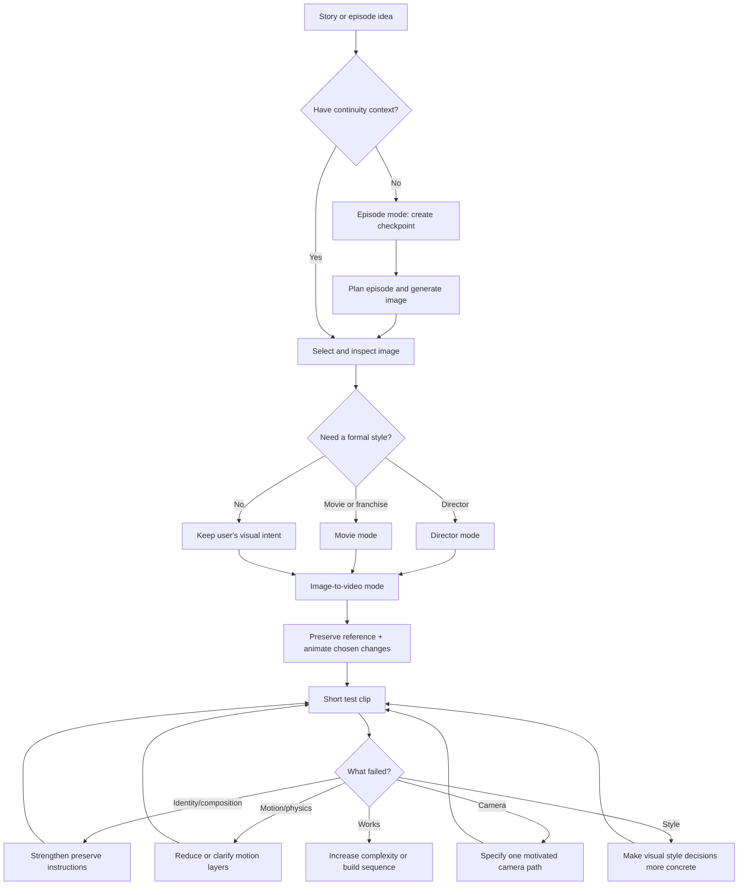

# How AI Episode Matrix works

AI Episode Matrix turns a rough story idea—or a selected reference image—into a continuous, controlled cinematic production that can be tested, refined, and extended across episodes.

## The default path



## Choose a mode

| Mode | Use it when | Main output |
|---|---|---|
| Image-base | You need the still image first | A complete reference-image prompt |
| Image-to-video | You have an image and want to animate it | Preserve/animate motion prompt |
| Director | You want a director’s formal grammar | Style-translated image or video prompt |
| Movie | You want a film/franchise homage or continuation | Scene-DNA prompt with relationship declared |
| Episode | You are starting or continuing a connected story | Continuity checkpoint, inherited prompt, and next-state handoff |
| Music video | You are building a short, beat-driven performance/narrative sequence | Beat-marked shot plan and compact image-to-video prompts |

Episode is the top-level continuity mode and can compose with the others: `episode + image-base + director`, followed by `episode + image-to-video + movie`.

Music-video mode is a compact continuity mode: plan to beat/lyric markers, separate performance from narrative coverage, and choose either frequent edits or deliberate one-take choreography.

## The core handoff

The image is the visual source of truth. The image-to-video prompt should not ask the engine to recreate the scene from scratch.

```text
PRESERVE:
  identity, face, wardrobe, props, composition, set geometry, palette, lighting

ANIMATE:
  one primary action, one camera move, selected secondary/environmental motion

CONTROL:
  start state, action beats, timing, end state, physical constraints

AVOID:
  identity drift, unwanted cuts, background deformation, flicker, extra limbs,
  rubbery physics, prop substitutions, text artifacts
```

## A reliable first test

Start with one short shot. Use one subject, one primary action, one camera movement, and one environmental motion. Include success criteria so the result can be judged rather than merely admired.

Example success criteria:

- The reference subject remains recognizable and visually consistent.
- The original framing and lighting remain intact.
- The action is readable from beginning to end.
- Camera movement is motivated, stable, and physically plausible.
- Secondary motion supports the shot without deforming the subject.

Change one major variable per revision. If identity fails, revise preservation instructions; if physics fail, simplify motion; if style fails, replace broad adjectives with concrete choices in lighting, lens, blocking, palette, and pacing.

## Style and aesthetic controls

Director/movie influence belongs in cinematic grammar: framing, blocking, lighting logic, camera behavior, pacing, motifs, and sound-image relationship.

Capture aesthetics are separate knobs:

```text
capture format → lens perspective → emulsion influence → presentation format
→ flash → grain → exposure/color → optical artifacts
```

This lets a user change “35mm anamorphic” to “65/70mm spherical” without losing the scene’s story or director grammar.

## Folding it into an existing workflow

### Prompt-only workflow

Use `image-base` for the initial still, then copy the generated image into `image-to-video` mode. Keep the output’s `PRESERVE`, `ANIMATE`, and `AVOID` sections intact when moving between engines.

### Existing storyboard workflow

Use the skill before production to turn each storyboard panel into an image-base prompt, then use each approved panel as the reference for a separate image-to-video shot. Maintain the continuity bible across all shots.

### Existing editor or clip workflow

Use the skill for generation and shot intent; keep clipping, reframing, subtitles, assembly, and final export in the editor. Pass shot IDs, entry/exit states, and transition intent to post-production.

### Multi-platform workflow

Create one platform-neutral creative specification first. Then request a platform pack. The skill should translate structure and preserve intent while marking unsupported or unverified engine controls instead of inventing syntax.

### ChatGPT image → Seedance video

Generate and approve the still first. Then send that exact image to Seedance with `PRESERVE`, `TRANSFORM`, timing/end-state, optional audio, and `AVOID` sections. Record the image version, Seedance model/prompt versions, settings, output take, observed failures, and approval status in a video-take record.

## Invocation examples

```text
$ai-episode-matrix

Use image-base mode. Create a reference-image prompt for...
```

```text
$ai-episode-matrix

Use image-to-video mode. Treat the attached image as the visual source of truth.
Preserve ... Animate ... Include success criteria.
```

```text
$ai-episode-matrix

Use image-base + director mode, then prepare the follow-up image-to-video prompt.
```

Read [SKILL.md](SKILL.md) for the complete operating instructions and [references/evaluation-rubric.md](references/evaluation-rubric.md) when comparing generated results.
